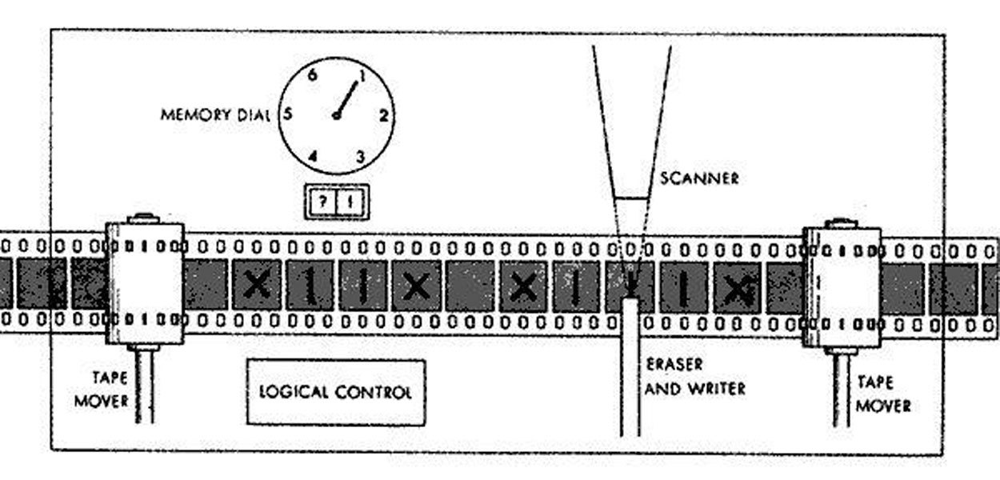

# Algorithms and Data Structures

Algorithms and Data Structures in C



## Installing dependencies

```
$ sudo apt-get install gcc build-essential libssl-dev cmake
```

## Compiling and running

```
$ cmake .
$ make
$ ./bin/<some listed program>
```

## Project content

### Base problems

| Problem                                       | Source                                                    | Description                                                                                                                                                                                                                     |
| --------------------------------------------- | --------------------------------------------------------- | ------------------------------------------------------------------------------------------------------------------------------------------------------------------------------------------------------------------------------- |
| Bag Problem                                   | [bag_problem.c](./src/grokking/bag_problem.c)             | Given a set of items, each with a weight and a value, determine the number of each item to include in a collection so that the total weight is less than or equal to a given limit and the total value is as large as possible. |
| Biggest Substring                             | [biggest_substring.c](./src/grokking/biggest_substring.c) |                                                                                                                                                                                                                                 |
| Binary Array Search                           | [binary_search.c](./src/grokking/binary_search.c)         | Search algorithm that finds the position of a target value within a sorted array.                                                                                                                                               |
| Divide and Conquer Array Sum                  | [dc_sum.c](./src/grokking/dc_sum.c)                       | Sum an array of integers with divide and conquer. It's just an example case.                                                                                                                                                    |
| Dijkstra algorithm                            | [dijkstra.c](./src/grokking/dijkstra.c)                   |                                                                                                                                                                                                                                 |
| Generic graph way algorithm                   | [graphway.c](./src/grokking/graphway.c)                   |                                                                                                                                                                                                                                 |
| Simple Greedy Algorithm                       | [greedy.c](./src/grokking/greedy.c)                       |                                                                                                                                                                                                                                 |
| Hash table algorithm                          | [hash_table.c](./src/grokking/hash_table.c)               | Implements an associative array with a simple structure with name field for hash table. The hash function is a Euclidean Extended Algorithm avoiding collisions.                                                                |
| KNN Iris algorithm                            | [knn.c](./src/grokking/knn.c)                             |                                                                                                                                                                                                                                 |
| Simple linked list implementation             | [linked_list.c](./src/grokking/linked_list.c)             | A generic linked list implementation. Works like a array of ints.                                                                                                                                                               |
| Array merge sort                              | [merge_sort.c](./src/grokking/merge_sort.c)               | Sort a array with merge sort algorithm. It has an O(nlog2n) time complexity. Most efficient sort algorithm for general-purpose cases.                                                                                           |
| Array quick sort                              | [quick_sort.c](./src/grokking/quick_sort.c)               | Sort a array with quick sort algorithm. It has an O(n^2) time complexity. It can be somewhat faster than merge sort and about two or three times faster than heapsort                                                           |
| Fibonacci, Memonacci and Factorial Recursivly | [recursion.c](./src/grokking/recursion.c)                 | Recursive algorithms comparation. The best case is Recursive Memonacci (recursive fibonacci implementation with memory).                                                                                                        |
| Array selection sort                          | [selection_sort.c](./src/grokking/selection_sort.c)       | Sort a array with selection sort algorithm. It has an O(n2) time complexity, which makes it inefficient on large lists, and generally performs worse than the similar insertion sort.                                           |

### Three problems

| Problem                             | Source                                                    | Description |
| ----------------------------------- | --------------------------------------------------------- | ----------- |
| AVL three implementation            | [avl.c](./src/grokking/three/avl.c)                       |             |
| B three implementation              | [b.c](./src/grokking/three/b.c)                           |             |
| Heap three implementation           | [heap.c](./src/grokking/three/heap.c)                     |             |
| R three implementation              | [r.c](./src/grokking/three/r.c)                           |             |
| Red Black three implementation      | [red_black.c](./src/grokking/three/red_black.c)           |             |
| Self Balancing three implementation | [self_balancing.c](./src/grokking/three/self_balancing.c) |             |
| Splay three implementation          | [splay.c](./src/grokking/three/splay.c)                   |             |
| Trie three implementation           | [trie.c](./src/grokking/three/trie.c)                     |             |